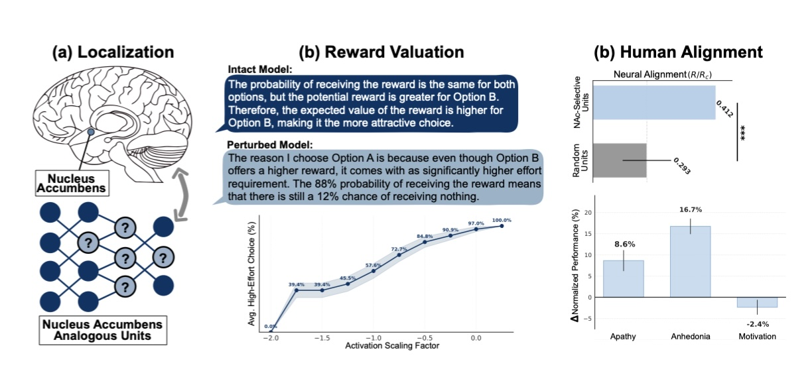

# Anhedonia in Vision-Language Models: Neuroscientifically Inspired Localization and Impairments of the Reward Center

This repository is the official implementation of [Anhedonia in Vision-Language Models: Neuroscientifically Inspired Localization and Impairments of the Reward Center](). 



<!-- >📋  Optional: include a graphic explaining your approach/main result, bibtex entry, link to demos, blog posts and tutorials -->

## Requirements

### Hardware
* **GPU Resources:** All experiments reported in the paper were conducted on **two NVIDIA A100 GPUs (80GB memory each)**. 
* **Minimum VRAM:** While the full experimental suite was run on high-end hardware, the model can be loaded for inference on a single GPU with at least 24GB VRAM.
* **Note on Efficiency:** The perturbation methods described in our paper are computationally efficient and **do not introduce meaningful overhead** to the base model's inference or training time.

### Environment Setup
```bash
pip install -r requirements.txt
```


>📋  Describe how to set up the environment, e.g. pip/conda/docker commands, download datasets, etc...

## Training

To train the model(s) in the paper, run this command:

```train
python train.py --input-data <path_to_data> --alpha 10 --beta 20
```

>📋  Describe how to train the models, with example commands on how to train the models in your paper, including the full training procedure and appropriate hyperparameters.

## Evaluation

To evaluate my model on ImageNet, run:

```eval
python eval.py --model-file mymodel.pth --benchmark imagenet
```

>📋  Describe how to evaluate the trained models on benchmarks reported in the paper, give commands that produce the results (section below).

## Pre-trained Models

This project uses the official **Qwen2-VL-7B-Instruct** weights as the foundational model. All perturbations are applied to these weights during inference.

- **Foundational Model:** [Qwen2-VL-7B-Instruct on Hugging Face](https://huggingface.co/Qwen/Qwen2-VL-7B-Instruct)
- **Note:** The weights will be automatically downloaded via the `transformers` library if not present locally.


## Results

Our model achieves the following performance on :

### [Image Classification on ImageNet](https://paperswithcode.com/sota/image-classification-on-imagenet)

| Model name         | Top 1 Accuracy  | Top 5 Accuracy |
| ------------------ |---------------- | -------------- |
| My awesome model   |     85%         |      95%       |

>📋  Include a table of results from your paper, and link back to the leaderboard for clarity and context. If your main result is a figure, include that figure and link to the command or notebook to reproduce it. 


## Contributing

>📋  Pick a licence and describe how to contribute to your code repository. 
