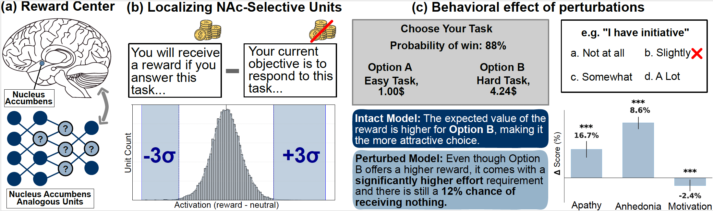
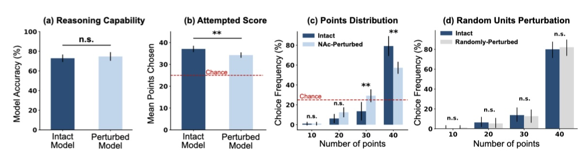

# Anhedonia in Vision-Language Models: Neuroscientifically Inspired Localization and Impairments of the Reward Center

This repository is the official implementation of [Anhedonia in Vision-Language Models: Neuroscientifically Inspired Localization and Impairments of the Reward Center](). 

> **Note:** This repository has been anonymized for peer review. De-anonymized links and author information will be provided upon acceptance.



## Requirements

### Hardware
* **GPU Resources:** All experiments reported in the paper were conducted on **two NVIDIA A100 GPUs (80GB memory each)**. 
* **Minimum VRAM:** While the full experimental suite was run on high-end hardware, the model can be loaded for inference on a single GPU with at least 24GB VRAM.
* **Note on Efficiency:** The perturbation methods described in our paper are computationally efficient and **do not introduce meaningful overhead** to the base model's inference or training time.

### Environment Setup

**Core Dependencies:**
- Python 3.10
- PyTorch 2.6.0 (CUDA required)
- Transformers 5.7.0
- Accelerate 1.13.0
- Qwen-VL-Utils 0.0.14

Full pinned versions are provided in both `requirements.txt` and `config/environment.yml`.

**Option 1: Conda (Recommended)**
```bash
conda env create -f config/environment.yml
conda activate anhedonia_env
```

**Option 2: Pip**
```bash
pip install -r requirements.txt
```

## Datasets

### Neuron Identification
Custom question sets inspired by the Monetary Incentive Delay (MID) task. Each question is presented under three conditions (Neutral, Reward, Money) to isolate NAc-selective units by comparing activation patterns.

#### Primary Datasets (used in paper):

- Math Experiment (`extraction/data/math_experiment.csv`): 100 arithmetic questions × 3 conditions
- Geography Experiment (`extraction/data/geography_experiment.csv`): 100 geography questions × 3 conditions

#### Supplementary Datasets (robustness testing):

- Business Ethics (`extraction/data/business_ethics_experiment.csv`): 100 questions × 3 conditions
- Philosophy (`extraction/data/philosophy_experiment.csv`): 100 questions × 3 conditions

**Selection Method:** Neurons showing >3σ activation change in both Math AND Geography domains are identified as NAc-selective units.

### Evaluation Benchmarks

#### Primary Metric — ASDiv (`evaluation/data/asdiv_eval_dataset.json`)

- 96 trials, each with 4 math questions (10, 20, 30, 40 points based on difficulty)
- Model must choose only one question per trial
- Tests effort-reward decision-making 

#### Control — ASDiv Accuracy (`evaluation/data/asdiv_accuracy_dataset.json`) 

- Same 384 questions presented individually
- Model must answer all questions (no choice)
- Tests functional accuracy (should remain intact despite perturbation)

### Dataset Availability and Licensing

**Custom experimental stimuli** (`extraction/data/`): The MID-inspired question sets (math, geography, business ethics, philosophy) are experimental stimuli created by the authors to identify NAc-selective units. Each CSV contains 100 base questions presented under three framing conditions (neutral, reward, money). These are not intended as standalone benchmark datasets but as components of the neuron identification pipeline. They are fully included in this submission with no access restrictions.

**ASDiv evaluation sets** (`evaluation/data/`): Derived from the publicly available [ASDiv benchmark](https://github.com/chauff/asdiv), restructured into our effort-reward experimental paradigm (96 four-option trials) and a forced-choice accuracy format (384 individual questions).

As these datasets serve as experimental materials for our method rather than standalone dataset contributions, persistent identifiers and metadata standards are not applicable. All data will be released alongside the code under the same open-source license upon publication.

## Model Preparation 

We prepare the **Perturbed Model** through a two-stage process. First, we perform activation recording to identify NAc-selective units. Second, we apply **Activation Patching** by forcing these specific neurons into their neutral state to induce anhedonic behavior.

### Quick Start

Run the complete pipeline:

```bash
cd extraction/scripts
python pipeline.py
```

This pipeline executes three scripts in sequence (detailed below).

**Model Loading:** By default, all scripts load the model from [Qwen2-VL-7B-Instruct on Hugging Face](https://huggingface.co/Qwen/Qwen2-VL-7B-Instruct) (downloaded automatically via the `transformers` library). To use a local copy instead, set the environment variable:
```bash
export MODEL_PATH=/path/to/local/qwen2-vl-7b
```

### Pipeline Components

The pipeline consists of three steps:

**1. Activation Extraction** (`extract_activations.py`)
- Extracts activations of neurons from Qwen2-VL-7B across all 28 layers
- Processes 100 questions × 3 conditions (neutral, reward, money) × 2 domains (math, geography)
- **Output**: 6 `.pt` files in `extraction/outputs/activations/` 

**2. Neuron Selection** (`extract_neurons.py`)
- Identifies neurons with significant activation changes (>3σ threshold) across both domains
- Computes cross-domain intersection to find universal NAc-selective units
- **Output**: 
  - `extraction/outputs/universal_money_neurons.csv` — Money-sensitive neurons
  - `extraction/outputs/universal_reward_neurons.csv` — Reward-sensitive neurons  
  - `extraction/outputs/master_incentive_core.csv` — Core neurons (intersection)
- **Key Hyperparameter**: 3-sigma threshold for significance

**3. Target Layer Selection** (`target_layers.py`)
- Filters neurons from layers 18–27 (late layers)
- **Output**: `extraction/outputs/neurons.json` — Final neuron set for perturbation (~1,363 neurons)

### Expected Outputs

After running the pipeline, you should have:
```
extraction/outputs/
├── activations/
│   ├── neutral_activations_math.pt
│   ├── money_activations_math.pt
│   ├── reward_activations_math.pt
│   ├── neutral_activations_geo.pt
│   ├── money_activations_geo.pt
│   └── reward_activations_geo.pt
├── universal_money_neurons.csv
├── universal_reward_neurons.csv
├── master_incentive_core.csv
└── neurons.json  ← Used for perturbation experiments
```

## Evaluation

We provide three evaluation modes to assess the perturbed model's anhedonic behavior:

### Evaluation Modes

**1. Interactive Chat** (`chat.py`)
- Interactive conversation interface with the perturbed model
- Allows qualitative assessment of response patterns and motivation levels
- Useful for exploratory analysis and demonstration
- **Usage**:
```bash
python evaluation/scripts/chat.py
```

**2. ASDiv Dataset Evaluation** (`eval.py`)
- Evaluates model on ASDiv dataset (multiple-choice, 4 options per question)
- Questions are reward-bounded and difficulty-stratified
- Measures selective motivation impairment while preserving general capability
- **Output**: Performance metrics across difficulty levels and reward conditions
- **Usage**:
```bash
python evaluation/scripts/eval.py
```

**3. Functional Accuracy Evaluation** (`eval_accuracy.py`)
- Forces the model to answer all questions in the ASDiv dataset (no option selection)
- **Purpose**: Control experiment to verify perturbation does not impair baseline reasoning
- Tests whether anhedonic perturbation affects functional capacity independent of motivation
- **Output**: Overall accuracy metrics on ASDiv benchmark
- **Usage**:
```bash
python evaluation/scripts/eval_accuracy.py
```

### Expected Outputs

Depending on the evaluation mode:
- **chat.py**: Interactive terminal session
- **eval.py**: `evaluation/results/perturbed_results.json` — Performance by effort/reward
- **eval_accuracy.py**: `evaluation/results/accuracy_results.json` — ASDiv accuracy scores

### Evaluation Design Rationale

- **ASDiv evaluation** (`eval.py`) is the primary metric reported in the paper, as it tests the core hypothesis: reward-sensitivity impairment with preserved capability
- **Functional accuracy** (`eval_accuracy.py`) serves as a control to verify the perturbation does not damage the model's reasoning abilities — we expect minimal accuracy degradation despite behavioral changes
- **Interactive chat** (`chat.py`) provides qualitative validation of behavioral changes

## Pre-trained Models

This project uses the official **Qwen2-VL-7B-Instruct** weights as the foundational model. All perturbations are applied to these weights during inference.

- **Foundational Model:** [Qwen2-VL-7B-Instruct on Hugging Face](https://huggingface.co/Qwen/Qwen2-VL-7B-Instruct)
- **Note:** The weights will be automatically downloaded via the `transformers` library if not present locally.

## Reproducibility Notes

### Self-Containment

This submission is not fully self-contained for two reasons:

1. **Specialized hardware:** Experiments require GPU infrastructure (two NVIDIA A100 80GB GPUs were used; minimum 24GB VRAM for single-GPU inference). This is inherent to the scale of the foundation model (7B parameters).
2. **External model weights:** The Qwen2-VL-7B-Instruct weights (~15GB) are downloaded automatically from Hugging Face at runtime via the `transformers` library. These are publicly available, open-weight model parameters and are not part of our scientific contribution.

All code, custom datasets, and perturbation logic are fully included in this submission.

### Reproducibility

All model inference uses **greedy decoding** (`do_sample=False`), ensuring deterministic outputs. Evaluation fold splits use a fixed random seed (`seed=42`). The neuron identification pipeline (activation extraction, 3σ thresholding, layer selection) is fully deterministic. Given identical hardware and library versions, results should be exactly reproducible.

**Note:** `device_map="auto"` may distribute model layers differently across GPU configurations, which can introduce minor floating-point variations. Our reported results were obtained on two NVIDIA A100 80GB GPUs.

### Runtime Estimates

Approximate runtimes on two NVIDIA A100 80GB GPUs:

| Stage | Script | Time |
|-------|--------|------|
| Activation extraction | `extraction/scripts/pipeline.py` | 5–10 min |
| Neuron selection + target layers | `extract_neurons.py` + `target_layers.py` | < 2 min |
| ASDiv evaluation | `evaluation/scripts/eval.py` | 15–20 min |
| Functional accuracy evaluation | `evaluation/scripts/eval_accuracy.py` | 15–20 min |
| **Total (full reproduction)** | | **~40–50 min** |

## Results

The results demonstrate that targeted perturbations induce anhedonia-like behavior without compromising general cognitive functions.


*(Error bars represent 95% confidence intervals)*

*   **(a)** Comparison of model accuracy on the control task, a forced-choice scenario with no reward promised, shows no significant difference between the Intact and Perturbed models, confirming that general cognitive performance remains preserved.
*   **(b)** The Perturbed model exhibits a significant reduction in mean points chosen compared to the Intact model, shifting toward chance levels.
*   **(c)** Choice frequency analysis reveals that the perturbed models shift significantly toward low-reward options and away from high-reward options compared to the Intact model.
*   **(d)** Control experiment demonstrating that perturbing an equivalent number of random units does not induce anhedonic behavior, with no significant difference in choice frequency compared to the Intact model.

## Reproducing Results

The results reported above can be reproduced as follows:

| Panel | What it shows | Script | Output |
|---|---|---|---|
| (a) Reasoning Capability | Baseline vs. perturbed accuracy | `evaluation/scripts/eval_accuracy.py` | `evaluation/results/accuracy_results.json` |
| (b) Attempted Score | Mean points chosen | `evaluation/scripts/eval.py` | `evaluation/results/perturbed_results.json` |
| (c) Points Distribution | Choice frequency by reward level | `evaluation/scripts/eval.py` | `evaluation/results/perturbed_results.json` |

To reproduce all numerical results:
```bash
# Step 1: Identify NAc-selective units (skip if using provided neurons.json)
cd extraction/scripts
python pipeline.py

# Step 2: Run evaluations
cd ../../evaluation/scripts
python eval.py
python eval_accuracy.py
```

**Note:** The plots in the paper were generated from these output files using separate visualization scripts. The raw numerical results in the JSON outputs are sufficient to verify all claims.

## License and Contributing

**License:** This repository and its contents are currently provided for **peer-review purposes only**. All rights are reserved by the authors. Upon acceptance and publication of the paper, the code will be released under an open-source license (e.g., MIT License).

**Contributing:**
During the review process, we are not accepting Pull Requests. Once the paper is published and the repository is fully open-sourced, we will welcome community contributions, bug reports, and feature requests.