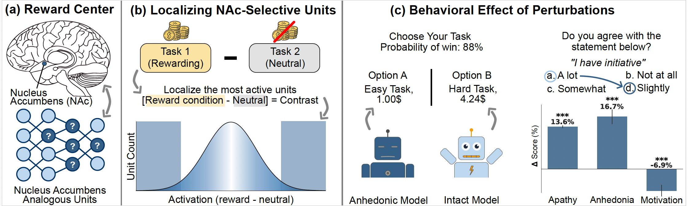

# Anhedonia in Vision-Language Models: Neuroscientifically Inspired Localization and Impairments of the Reward Center

> This repository has been anonymized for peer review.



## Setup

Requires Python 3.10 and a CUDA GPU (24GB+ VRAM recommended).

```bash
pip install -r requirements.txt
```

The base model (Qwen2-VL-7B-Instruct) is downloaded automatically from Hugging Face. To use a local copy, set `MODEL_PATH=/path/to/model`.

## Usage

**1. Identify reward-selective units**

```bash
cd extraction/scripts
python extract_activations.py      # record activations under neutral and reward conditions
python extract_neurons.py          # select units with high reward-related changes
python target_layers.py            # choose candidate units from later layers
python filter_selected_neurons.py  # language ability check
```

The final unit set used in the paper is provided in `extraction/outputs/neurons.json`.  


**2. Evaluate**

```bash
cd ../../evaluation/scripts
python eval.py            # effort-reward choice task
python eval_accuracy.py   # accuracy control
```

Results are saved to `evaluation/results/`.

Scripts for additional models are in `other_models/`.

## License

Provided for peer review only. The code will be released under an open-source license upon publication.